<div align="center">
  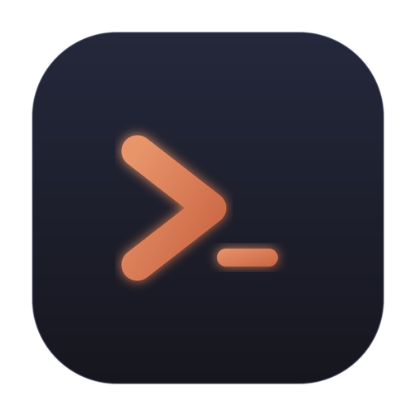

  <h1>Syndrome AI</h1>
  
  <p>
    <strong>A powerful GUI app and Toolkit for Claude Code</strong>
  </p>
  <p>
    <strong>Create custom agents, manage interactive Claude Code sessions, switch AI models on the fly, and more.</strong>
  </p>
  
  <p>
    <a href="#features"></a>
    <a href="#installation"></a>
    <a href="#usage"></a>
    <a href="#development"></a>
  </p>
</div>

> [!NOTE]
> This project is not affiliated with, endorsed by, or sponsored by Anthropic. Claude is a trademark of Anthropic, PBC. This is an independent developer project using Claude.

> [!NOTE]
> Forked from [opcode](https://github.com/winfunc/opcode) (AGPL-3.0) with additional features including the model switcher.

## 🌟 Overview

**Syndrome AI** is a powerful desktop application that transforms how you interact with Claude Code. Built with Tauri 2, it provides a beautiful GUI for managing your Claude Code sessions, creating custom agents, tracking usage, switching between AI models, and much more.

Think of Syndrome AI as your command center for Claude Code — bridging the gap between the command-line tool and a visual experience that makes AI-assisted development more intuitive and productive.

## 🎥 Demo

<div align="center">

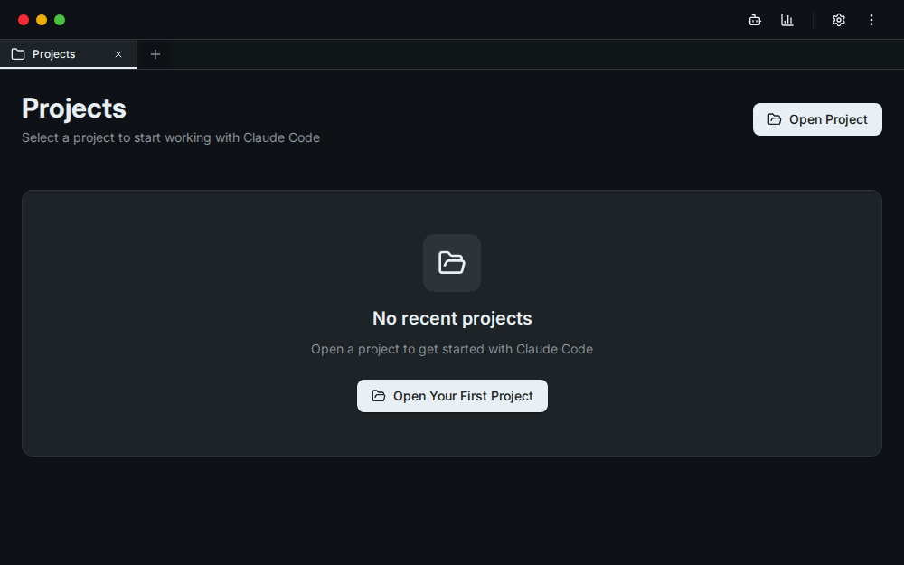

*A quick tour through the app. A higher-quality recording is available at [`docs/demo.webm`](docs/demo.webm).*

</div>

## 📸 Screenshots

<div align="center">

| Projects | Create Agent |
|:---:|:---:|
| 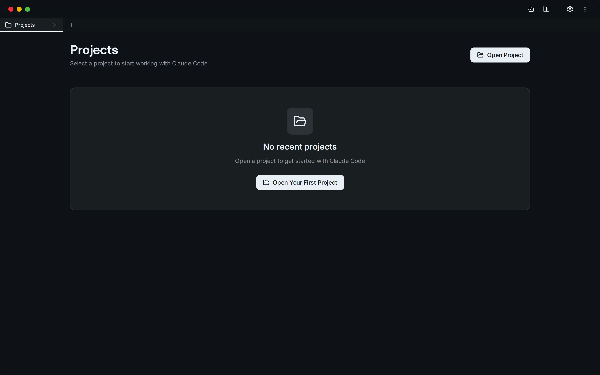 | 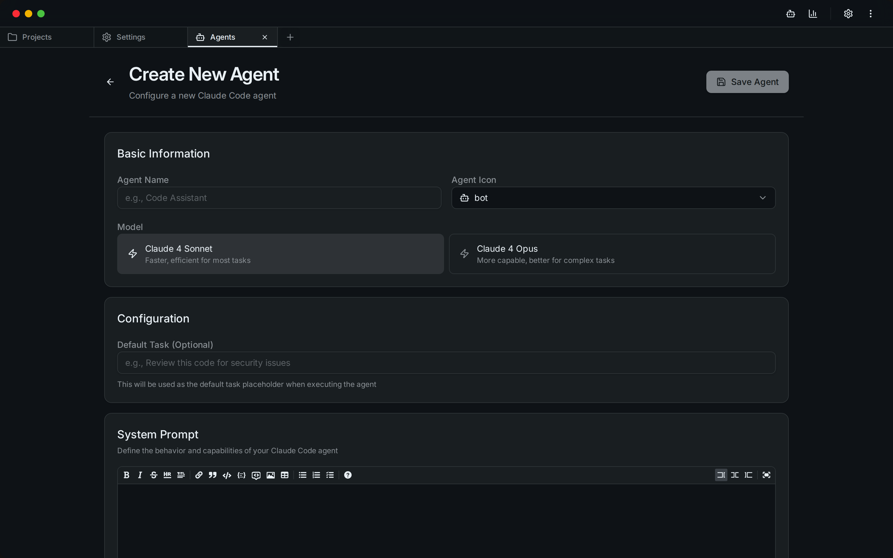 |
| **Model Switcher** (cloud ↔ local) | **Permission Rules** |
| 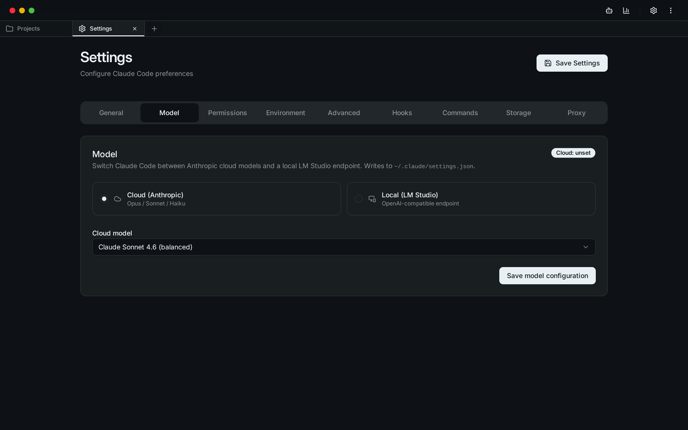 | 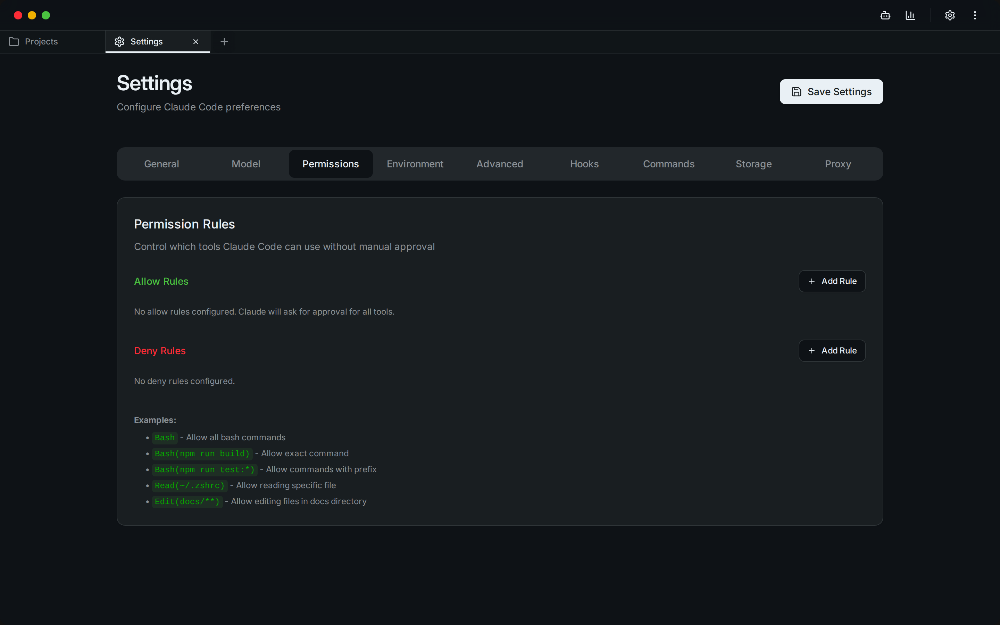 |
| **General Settings** | **Lifecycle Hooks** |
| 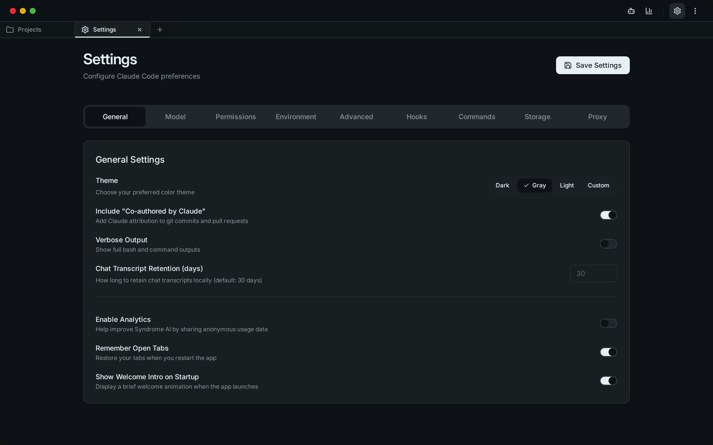 | 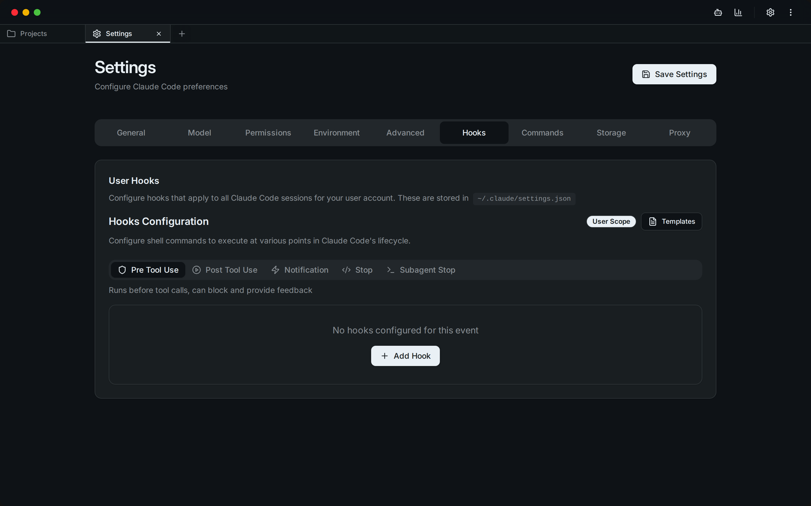 |
| **Environment Variables** | **Advanced Settings** |
| 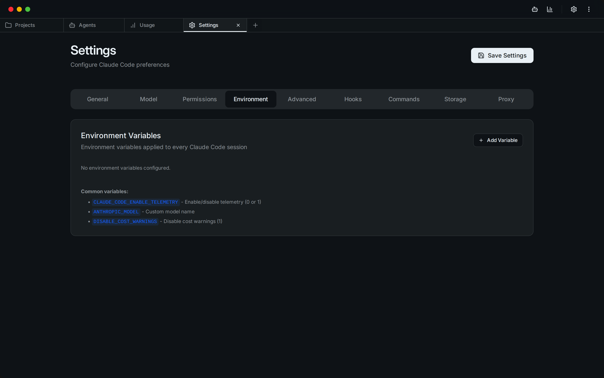 | 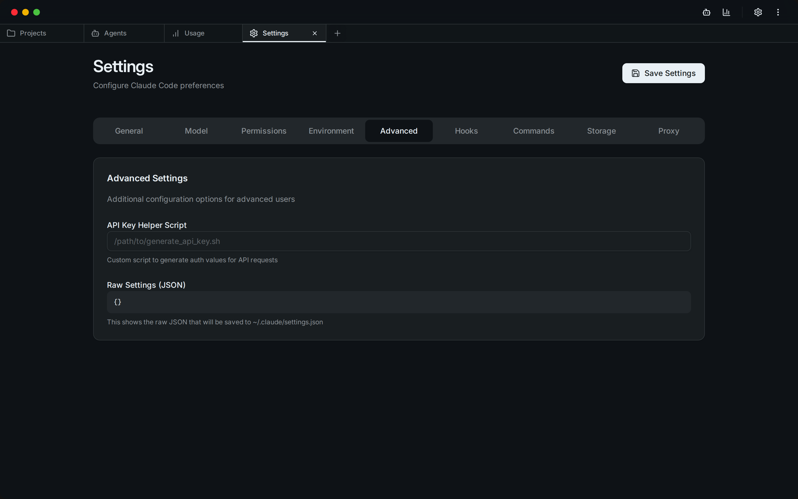 |
| **MCP Server Management** | |
| 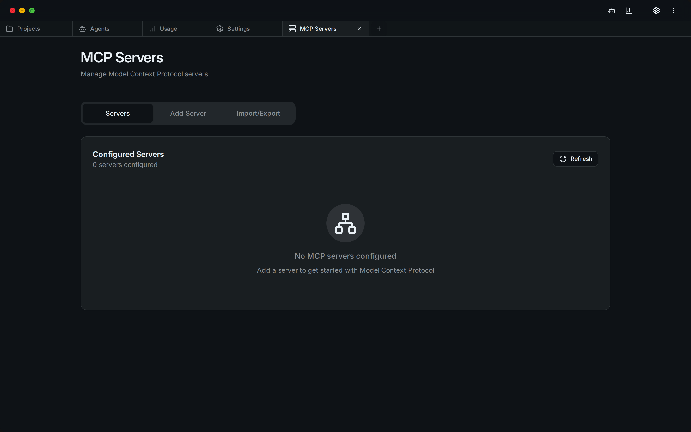 | |

</div>

## 📋 Table of Contents

- [🌟 Overview](#-overview)
- [🎥 Demo](#-demo)
- [📸 Screenshots](#-screenshots)
- [✨ Features](#-features)
  - [🗂️ Project & Session Management](#️-project--session-management)
  - [🤖 CC Agents](#-cc-agents)
  - [🔄 Model Switcher](#-model-switcher)
  - [📊 Usage Analytics Dashboard](#-usage-analytics-dashboard)
  - [🔌 MCP Server Management](#-mcp-server-management)
  - [⏰ Timeline & Checkpoints](#-timeline--checkpoints)
  - [📝 CLAUDE.md Management](#-claudemd-management)
- [📖 Usage](#-usage)
  - [Getting Started](#getting-started)
  - [Managing Projects](#managing-projects)
  - [Creating Agents](#creating-agents)
  - [Switching Models](#switching-models)
  - [Tracking Usage](#tracking-usage)
  - [Working with MCP Servers](#working-with-mcp-servers)
- [🚀 Installation](#-installation)
- [🔨 Build from Source](#-build-from-source)
- [🛠️ Development](#️-development)
- [🔒 Security](#-security)
- [🤝 Contributing](#-contributing)
- [📄 License](#-license)
- [🙏 Acknowledgments](#-acknowledgments)

## ✨ Features

### 🗂️ **Project & Session Management**
- **Visual Project Browser**: Navigate through all your Claude Code projects in `~/.claude/projects/`
- **Session History**: View and resume past coding sessions with full context
- **Smart Search**: Find projects and sessions quickly with built-in search
- **Session Insights**: See first messages, timestamps, and session metadata at a glance

### 🤖 **CC Agents**
- **Custom AI Agents**: Create specialized agents with custom system prompts and behaviors
- **Agent Library**: Build a collection of purpose-built agents for different tasks
- **Background Execution**: Run agents in separate processes for non-blocking operations
- **Execution History**: Track all agent runs with detailed logs and performance metrics

### 🔄 **Model Switcher**
- **Cloud Models**: Switch between Anthropic cloud models (claude-opus-4, claude-sonnet-4, etc.)
- **Local LLMs**: Connect to a local LM Studio endpoint for offline/private inference
- **Instant Switching**: Change models without restarting — writes directly to `~/.claude/settings.json`
- **Endpoint Testing**: Validate local endpoints before committing to them

### 📊 **Usage Analytics Dashboard**
- **Cost Tracking**: Monitor your Claude API usage and costs in real-time
- **Token Analytics**: Detailed breakdown by model, project, and time period
- **Visual Charts**: Beautiful charts showing usage trends and patterns
- **Export Data**: Export usage data for accounting and analysis

### 🔌 **MCP Server Management**
- **Server Registry**: Manage Model Context Protocol servers from a central UI
- **Easy Configuration**: Add servers via UI or import from existing configs
- **Connection Testing**: Verify server connectivity before use
- **Claude Desktop Import**: Import server configurations from Claude Desktop

### ⏰ **Timeline & Checkpoints**
- **Session Versioning**: Create checkpoints at any point in your coding session
- **Visual Timeline**: Navigate through your session history with a branching timeline
- **Instant Restore**: Jump back to any checkpoint with one click
- **Fork Sessions**: Create new branches from existing checkpoints
- **Diff Viewer**: See exactly what changed between checkpoints

### 📝 **CLAUDE.md Management**
- **Built-in Editor**: Edit CLAUDE.md files directly within the app
- **Live Preview**: See your markdown rendered in real-time
- **Project Scanner**: Find all CLAUDE.md files in your projects
- **Syntax Highlighting**: Full markdown support with syntax highlighting

## 📖 Usage

### Getting Started

1. **Launch Syndrome AI**: Open the application after installation
2. **Welcome Screen**: Choose between CC Agents or Projects
3. **First Time Setup**: Syndrome AI will automatically detect your `~/.claude` directory

### Managing Projects

```
Projects → Select Project → View Sessions → Resume or Start New
```

- Click on any project to view its sessions
- Each session shows the first message and timestamp
- Resume sessions directly or start new ones

### Creating Agents

```
CC Agents → Create Agent → Configure → Execute
```

1. **Design Your Agent**: Set name, icon, and system prompt
2. **Configure Model**: Choose between available Claude models
3. **Set Permissions**: Configure file read/write and network access
4. **Execute Tasks**: Run your agent on any project

### Switching Models

```
Settings → Model Switcher → Select Mode
```

- **Cloud**: Choose an Anthropic model from the dropdown
- **Local**: Enter your LM Studio base URL and model name, click Test then Save

### Tracking Usage

```
Menu → Usage Dashboard → View Analytics
```

- Monitor costs by model, project, and date
- Export data for reports

### Working with MCP Servers

```
Menu → MCP Manager → Add Server → Configure
```

- Add servers manually or via JSON
- Import from Claude Desktop configuration
- Test connections before using

## 🚀 Installation

### Prerequisites

- **Claude Code CLI**: Install from [Claude's official site](https://claude.ai/code)

### Linux (.deb)

Download the latest `.deb` from [Releases](../../releases) and install:

```bash
sudo dpkg -i syndrome-ai_*.deb
```

### Linux (AppImage)

Download the `.AppImage` from [Releases](../../releases), make it executable, and run:

```bash
chmod +x "Syndrome AI_*.AppImage"
./"Syndrome AI_*.AppImage"
```

> **Note**: On systems with `/tmp` mounted `noexec`, run with:
> ```bash
> APPIMAGE_EXTRACT_AND_RUN=1 ./"Syndrome AI_*.AppImage"
> ```

## 🔨 Build from Source

### Prerequisites

Before building from source, ensure you have the following installed:

#### System Requirements

- **Operating System**: Linux (Ubuntu 20.04+) — primary target
- **RAM**: Minimum 4GB (8GB recommended)
- **Storage**: At least 2GB free space for build artifacts

#### Required Tools

1. **Rust** (1.70.0 or later)
   ```bash
   curl --proto '=https' --tlsv1.2 -sSf https://sh.rustup.rs | sh
   ```

2. **Node.js + npm** (v18 or later)
   ```bash
   # Via nvm (recommended)
   curl -o- https://raw.githubusercontent.com/nvm-sh/nvm/v0.39.0/install.sh | bash
   nvm install --lts
   ```

3. **Claude Code CLI**
   - Download and install from [Claude's official site](https://claude.ai/code)
   - Ensure `claude` is available in your PATH

#### Linux System Dependencies (Ubuntu/Debian)

```bash
sudo apt update
sudo apt install -y \
  libwebkit2gtk-4.1-dev \
  libgtk-3-dev \
  libayatana-appindicator3-dev \
  librsvg2-dev \
  patchelf \
  build-essential \
  curl \
  wget \
  file \
  libssl-dev \
  libxdo-dev \
  libsoup-3.0-dev \
  libjavascriptcoregtk-4.1-dev
```

### Build Steps

1. **Clone the Repository**
   ```bash
   git clone https://github.com/YOUR_USERNAME/syndrome-ai.git
   cd syndrome-ai
   ```

2. **Install Frontend Dependencies**
   ```bash
   npm install
   ```

3. **Build the Application**

   **For Development (with hot reload)**
   ```bash
   npx tauri dev
   ```

   **For Production Build**
   ```bash
   npx tauri build
   ```

   Built packages will be in `src-tauri/target/release/bundle/`.

4. **Linux AppImage** (if `/tmp` is `noexec`):
   ```bash
   mkdir -p ~/.cache/appimage-tmp
   TMPDIR=~/.cache/appimage-tmp APPIMAGE_EXTRACT_AND_RUN=1 npx tauri build --bundles appimage
   ```

### Troubleshooting

1. **"cargo not found"** — Run `source ~/.cargo/env` or restart your terminal
2. **"webkit2gtk not found"** — Install system dependencies above
3. **"claude command not found"** — Ensure Claude Code CLI is installed and in your PATH
4. **AppImage fails to run** — Use `APPIMAGE_EXTRACT_AND_RUN=1` (see above)

### Verify Your Build

```bash
./src-tauri/target/release/syndrome-ai --version
```

## 🛠️ Development

### Tech Stack

- **Frontend**: React 18 + TypeScript + Vite 6
- **Backend**: Rust with Tauri 2
- **UI Framework**: Tailwind CSS v4 + shadcn/ui
- **Database**: SQLite (via rusqlite)
- **Package Manager**: npm

### Project Structure

```
syndrome-ai/
├── src/                   # React frontend
│   ├── components/        # UI components
│   ├── lib/               # API client & utilities
│   └── assets/            # Static assets
├── src-tauri/             # Rust backend
│   ├── src/
│   │   ├── commands/      # Tauri command handlers
│   │   ├── checkpoint/    # Timeline management
│   │   └── process/       # Process management
│   └── tests/             # Rust test suite
└── public/                # Public assets
```

### Development Commands

```bash
# Type check (tsc + cargo check)
npm run check

# Start development server
npx tauri dev

# Run Rust tests
cd src-tauri && cargo test

# Format Rust code
cd src-tauri && cargo fmt

# Run CI checks
python3 scripts/run_ci.py src/ --docs .plans/claude-code-gui/docs
```

## 🔒 Security

Syndrome AI prioritizes your privacy and security:

1. **Process Isolation**: Agents run in separate processes
2. **Permission Control**: Configure file and network access per agent
3. **Local Storage**: All data stays on your machine
4. **No Telemetry**: No data collection or tracking
5. **Open Source**: Full transparency through open source code
6. **Localhost-only Web Mode**: The web server binds to 127.0.0.1 only
7. **URL Validation**: GitHub agent downloads are restricted to `raw.githubusercontent.com`

## 🤝 Contributing

Contributions welcome! Please see [CONTRIBUTING.md](CONTRIBUTING.md) for details.

### Areas for Contribution

- Bug fixes and improvements
- New features and enhancements
- Documentation improvements
- UI/UX enhancements
- Test coverage

## 📄 License

This project is licensed under the AGPL-3.0 License — see the [LICENSE](LICENSE) file for details.

## 🙏 Acknowledgments

- Forked from [opcode](https://github.com/winfunc/opcode) by winfunc — the original Claude Code GUI
- Built with [Tauri](https://tauri.app/) — The secure framework for building desktop apps
- [Claude](https://claude.ai) by Anthropic

---
